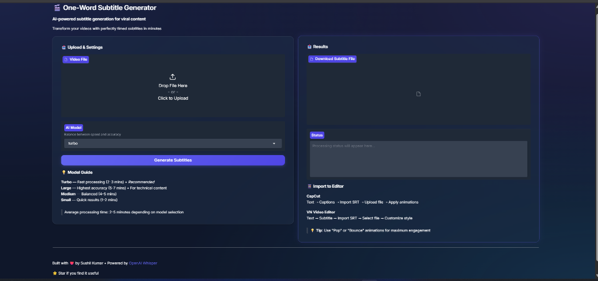

> [!IMPORTANT]
> **🚀 QUICK START: It's extremely simple!**
> 1. **Clone Repo** → 2. **Install Requirements** → 3. **Run `python app.py`**
> No complex setup needed. Just run and generate!

# 🎬 SaaS Subtitle Generator




**Generate viral, "Hormozi-style" one-word subtitles instantly using OpenAI Whisper.**

This tool is a modern, AI-powered subtitle generator designed for content creators who need professional, perfectly timed subtitles for Reels, Shorts, and TikToks. It features a beautiful **Glassmorphism UI** and runs 100% locally on your machine for maximum privacy and speed.

---

## ✨ Features

- **🚀 AI-Powered Accuracy**: Uses OpenAI's state-of-the-art **Whisper** models.
- **⚡ Turbo Speed**: Includes the new `Turbo` model for 8x faster processing.
- **🎨 Modern SaaS UI**: Premium Glassmorphism interface with smooth animations and dark mode aesthetics.
- **🔒 Privacy First**: Runs entirely on your local machine. No data leaves your computer.
- **📱 Social Ready**: Generates standard `.srt` files compatible with **CapCut**, **VN Editor**, **Premiere Pro**, and **DaVinci Resolve**.
- **🎯 Precision Timing**: Word-level timestamps for that "popping" viral text effect.

---

## 🛠️ Installation

### Prerequisites
- **Python 3.8+**: [Download Here](https://www.python.org/downloads/)
- **FFmpeg**: Required for audio processing.
    - **Windows**: `winget install ffmpeg` or [Download Build](https://gyan.dev/ffmpeg/builds/)
    - **Mac**: `brew install ffmpeg`
    - **Linux**: `sudo apt install ffmpeg`

### 1. Clone the Repository
```bash
git clone https://github.com/sushilbyte7/reels-subtitle-generator.git
cd reels-subtitle-generator
```

### 2. Install Dependencies
```bash
pip install -r requirements.txt
```
*Note: This will install `openai-whisper` and `gradio`.*

---

## 🚀 Usage

### Option A: Modern UI (Recommended)
Launch the beautiful web interface:
```bash
python app.py
```
Open **http://localhost:7860** in your browser.

- **Upload** your video file.
- **Select** your AI model (Turbo is recommended for speed).
- **Click Generate** and download your `.srt` file properly.

### Option B: Command Line Interface (CLI)
For power users who prefer the terminal:
```bash
python main.py -i "path/to/video.mp4" -m turbo
```

**Arguments:**
- `-i` : Input video file path (Required)
- `-m` : Model name (default: `turbo`)
- `-o` : Output directory (Optional)

---

## 🤖 Models & Performance

Choose the right model for your hardware and needs.

| Model | Parameters | VRAM Required | Relative Speed | Best For |
| :--- | :--- | :--- | :--- | :--- |
| **Tiny** | 39 M | ~1 GB | ~32x | Fast testing on older CPUs |
| **Base** | 74 M | ~1 GB | ~16x | Good balance for clear audio |
| **Small** | 244 M | ~2 GB | ~6x | General content creation |
| **Medium** | 769 M | ~5 GB | ~2x | High accuracy needs |
| **Large** | 1550 M | ~10 GB | 1x | Technical/Academic content |
| **Turbo** | **809 M** | **~6 GB** | **~8x** | **🚀 Recommended Producer's Choice** |

*Note: First run will automatically download the selected model to your cache.*

---

## 📂 Project Structure

```
reels-subtitle-generator/
├── app.py              # Main Gradio application (UI)
├── main.py             # CLI entry point
├── requirements.txt    # Python dependencies
├── UI_IMPROVEMENTS.md  # Design document
├── README.md           # Documentation
└── assets/             # Images and static assets
```

---

## 🐛 Common Errors & Fixes

**Error: `FileNotFoundError: [WinError 2] The system cannot find the file specified`**
- **Fix**: FFmpeg is not installed or not in your PATH. Install FFmpeg and restart your terminal.

**Error: `CUDA not found` / Slow processing**
- **Fix**: You are running on CPU. For GPU acceleration, ensure you have NVIDIA drivers and CUDA toolkit installed.

---

## ⚠️ Limitations
- **Local Only**: This tool is designed for local use.
- **GPU Recommended**: While it runs on CPU, a GPU (NVIDIA) significantly speeds up transcription.

---

## 📄 License

This project is licensed under the MIT License - see the [LICENSE](license.txt) file for details.

---

<center>
Built with ❤️ by <a href="https://github.com/sushilbyte7">Sushil Kumar</a>
</center>